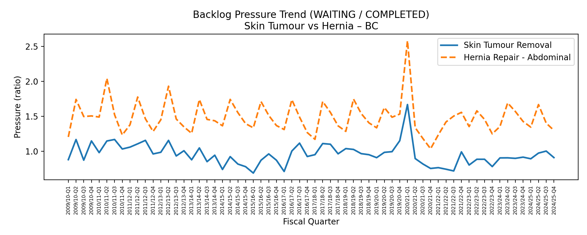
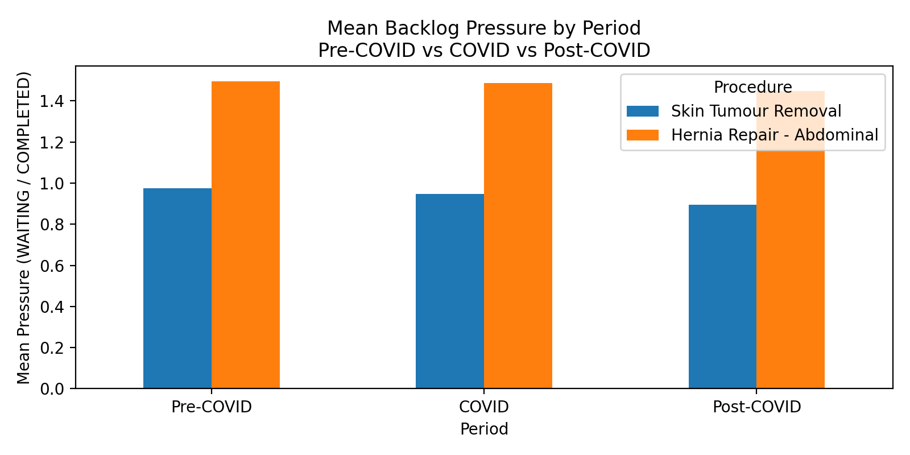

# BC Surgical Wait Times — Backlog Pressure Analysis (2009–2025)

## Overview
This project analyzes surgical wait times in **British Columbia** to quantify **demand vs capacity** over time using a simple and interpretable metric:

**Backlog Pressure = WAITING / COMPLETED**

- **WAITING**: number of cases waiting at a point in time (backlog)
- **COMPLETED**: number of scheduled surgeries completed during the period (system throughput)
- Values **greater than 1** indicate that demand exceeds system capacity

---

## Data Source
**Open Government Data — Province of British Columbia**  
Dataset: *Quarterly Surgical Wait Times (2009–2025)*  
File location: `data/raw/bc_surgical_wait_times_quarterly_2009_2025.xlsx`  

This dataset is released under the **Open Government Licence – British Columbia**.

---

## Objectives
1. Build a clean and reproducible pipeline to aggregate waitlist and completed cases by fiscal quarter.
2. Compare backlog pressure trends across two high-volume procedures:
   - **Skin Tumour Removal**
   - **Hernia Repair – Abdominal**
3. Identify system-level patterns across **Pre-COVID, COVID, and Post-COVID** periods.

---

## Key Findings
- **Hernia Repair – Abdominal** consistently shows **higher backlog pressure** than **Skin Tumour Removal**, indicating stronger capacity constraints.
- Both procedures experienced clear backlog spikes during the **COVID period**, confirming system-wide disruption.
- Post-COVID, **Skin Tumour Removal** pressure normalizes more quickly, while **Hernia Repair** remains persistently elevated—suggesting a more structural backlog issue.

---

## Methods
- Filtered the dataset by procedure group.
- Converted `WAITING` and `COMPLETED` to numeric values safely using `to_numeric(errors="coerce")`.
- Aggregated totals across all hospitals by `FISCAL_YEAR` and `QUARTER`.
- Created a fiscal quarter time index for longitudinal comparison.
- Computed backlog pressure and visualized trends using line charts.

---

## Visuals
The chart below compares backlog pressure across fiscal quarters for both procedures:





•	“Chart 1 shows quarterly trends; Chart 2 summarizes average pressure across Pre-COVID/COVID/Post-COVID.”

### COVID Impact Highlight
The shaded region highlights the COVID period (FY 2019/20–2021/22), showing how backlog pressure evolved during system-wide disruption.


---

## Executive Summary
Using BC surgical wait time data (2009–2025), this analysis compares **system demand vs capacity** over time using backlog pressure.

**Key insight:**  
While both procedures were affected by COVID-related disruptions, **hernia repair exhibits persistently higher backlog pressure**, suggesting longer-term capacity challenges compared to skin tumour removal.

---

## COVID Period Summary (Mean Backlog Pressure)

| Procedure | Pre-COVID | COVID | Post-COVID |
|---|---:|---:|---:|
| Skin Tumour Removal | 0.974 | 0.948 | 0.896 |
| Hernia Repair – Abdominal | 1.494 | 1.486 | 1.449 |

**Interpretation**
- **Skin Tumour Removal** stays near/below 1 and improves post-COVID.
- **Hernia Repair – Abdominal** remains **persistently above 1**, indicating ongoing capacity constraints beyond COVID.

---

## Repository Structure
```text
health-analytics-project/
├── data/
│   └── raw/            # Source data (local)
├── notebooks/          # Exploratory analysis
├── reports/
│   └── figures/        # Generated charts
├── src/                # Reusable scripts
├── main.py
├── requirements.txt
├── README.md
└── .gitignore
```
