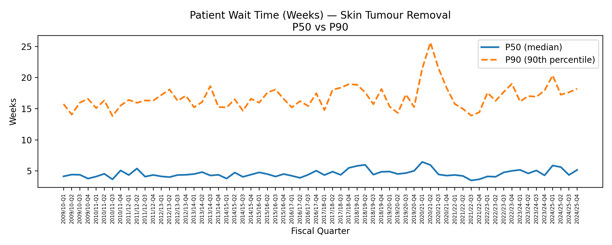
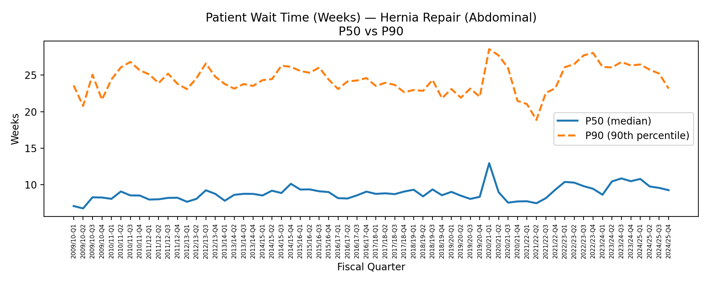
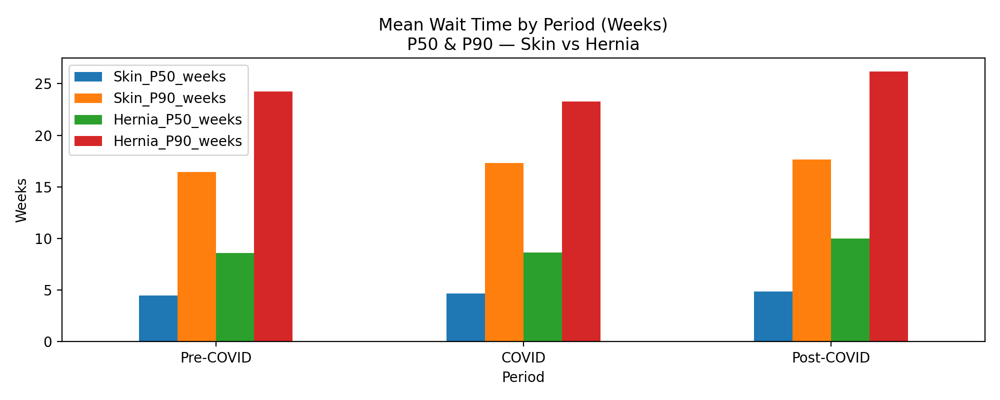

# BC Surgical Wait Times — Backlog Pressure Analysis (2009–2025)

## Overview
This project analyzes surgical wait times in **British Columbia** to quantify **demand vs capacity** over time using a simple and interpretable metric:

**Backlog Pressure = WAITING / COMPLETED**
> Note: Backlog Pressure is a practical proxy metric for capacity strain, not an official waitlist definition. 

- **WAITING**: number of cases waiting at a point in time (backlog)
- **COMPLETED**: number of scheduled surgeries completed during the period (system throughput)
- Values **greater than 1** indicate that demand exceeds system capacity.

---

## Data Source
**Open Government Data — Province of British Columbia**  
Dataset: *Quarterly Surgical Wait Times (2009–2025)*  
File location (local): `data/raw/bc_surgical_wait_times_quarterly_2009_2025.xlsx`  

This dataset is released under the **Open Government Licence – British Columbia**.

---

## Objectives
1. Build a clean and reproducible pipeline to aggregate waitlist and completed cases by fiscal quarter.
2. Compare backlog pressure trends across two high-volume procedures:
   - **Skin Tumour Removal**
   - **Hernia Repair – Abdominal**
3. Summarize patterns across **Pre-COVID, COVID, and Post-COVID** periods.

---

## Key Findings
- **Hernia Repair – Abdominal** consistently shows **higher backlog pressure** than **Skin Tumour Removal**, indicating stronger capacity constraints.
- The COVID period shows system disruption and pattern shifts in quarterly backlog pressure and wait-time percentiles.
- Post-COVID, **Skin Tumour Removal** pressure remains below 1 and trends lower, while **Hernia Repair** stays **persistently above 1**, suggesting longer-term capacity constraints.

---

## Methods
- Filtered the dataset by procedure group.
- Converted `WAITING` and `COMPLETED` to numeric values safely using `to_numeric(errors="coerce")`.
- Aggregated totals across all hospitals by `FISCAL_YEAR` and `QUARTER`.
- Created a fiscal quarter time index for longitudinal comparison.
- Computed backlog pressure and visualized trends using line charts.

---

## Visuals
**Chart 1** shows quarterly trends; **Chart 2** summarizes average pressure across Pre-COVID/COVID/Post-COVID.


## Patient Wait Time Analysis (Percentiles)

In addition to backlog pressure, this project analyzes **patient experience**
using wait-time percentiles reported in the dataset:

- **P50 (Median Wait Time)** — typical patient experience
- **P90 (90th Percentile)** — long-wait / worst-case experience

These metrics help distinguish **system pressure** from **patient-level impact**.

### Skin Tumour Removal — P50 vs P90


### Hernia Repair – Abdominal — P50 vs P90


### Mean Wait Time by Period (Weeks)
This chart summarizes how median and long-wait patients were affected across

**Pre-COVID, COVID, and Post-COVID** periods.


---

## Executive Summary
Using BC surgical wait time data (2009–2025), this analysis compares **system demand vs capacity** over time using backlog pressure.
This analysis demonstrates how aggregate system capacity metrics
and patient-level percentiles can be combined to identify
structural versus temporary access constraints in healthcare services.

**Key insight:**  
Across the full study period, hernia repair exhibits persistently higher backlog pressure,
indicating sustained capacity constraints rather than temporary disruption.

---

## COVID Period Summary (Mean Backlog Pressure)

| Procedure | Pre-COVID | COVID | Post-COVID |
|---|---:|---:|---:|
| Skin Tumour Removal | 0.974 | 0.948 | 0.896 |
| Hernia Repair – Abdominal | 1.494 | 1.486 | 1.449 |

### Key Wait-Time Insight
- Median wait times (P50) remain relatively stable for **Skin Tumour Removal**.
- **Hernia Repair** shows substantially higher P90 values, indicating a
  heavier tail of long-wait patients.
- Post-COVID, long-wait pressure (P90) remains elevated for hernia procedures,
  even when median waits stabilize.

**Interpretation**
- **Skin Tumour Removal** stays near/below 1 and improves post-COVID.
- **Hernia Repair – Abdominal** remains **persistently above 1**, indicating ongoing capacity constraints beyond COVID.

---

## Notes / Limitations
- This analysis aggregates across **all hospitals** in BC. Facility-level trends may differ.
- Some small values are suppressed in the source dataset (<5), which can affect sub-totals in detailed breakdowns.

---
## How to Run

```bash
python3 -m venv venv
source venv/bin/activate
pip install -r requirements.txt
python3 main.py 
```
## Repository Structure

```text
health-analytics-project/
├── data/
│   └── raw/            # Source data (local)
├── notebooks/          # Exploratory analysis
├── reports/
│   └── figures/        # Generated charts
├── src/                # Reusable scripts
├── main.py
├── requirements.txt
├── README.md
└── .gitignore